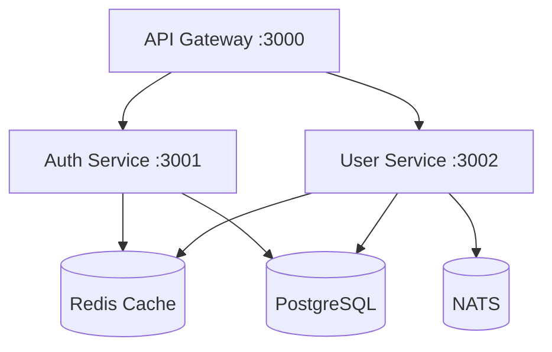

# SaaSaaS Requirements Summary

## Based on User Responses - 2025-10-30

---

## 🎯 Project Vision

**Name**: SaaS-as-a-Service (SaaSaaS)

**Purpose**: Production-ready CLI tool that generates complete, modern microservices architectures for SaaS applications using Fastify and best practices.

**Target Audience**: Broad developer community (junior to senior) - requires excellent documentation and intuitive UX.

**Timeline**: Iterative development, no rush - focus on building it right.

---

## 🏗️ Core Architecture Decisions

### Framework Choice
**Fastify Only** (MVP)
- ⚡ Blazing fast performance
- 🪶 Lightweight and unopinionated
- 📊 Built-in JSON Schema validation
- 🔌 Plugin-based architecture
- 📝 TypeScript support

**Reasoning**: Performance-focused, clean patterns, modern approach

---

### Infrastructure Stack

#### Cache Layer
**Redis** (Standard)
- High-speed key-value store
- Session management
- Rate limiting
- Pub/sub messaging

#### Database Strategy
**Flexible Options** (User chooses during init):
- **PostgreSQL** - Traditional, proven, enterprise-grade
- **SQLite + LiteFS** - Modern, embeddable, edge-ready multi-region

**Database-per-Service**: Default to separate databases for true microservices isolation

#### Message Queue
**NATS** (Recommended for 2025)
- Cloud-native messaging
- High performance
- Simple operations
- Built-in clustering

#### Multi-Tenancy
**Schema-per-Tenant** (PostgreSQL)
- Each tenant gets own schema
- Good balance of isolation and simplicity
- Efficient resource usage
- Easier management than separate databases

---

## 🛠️ CLI Tool Architecture

### Structure
**Monorepo** (pnpm workspaces)
```
saasaas/
├── packages/
│   ├── cli/           # CLI tool
│   ├── templates/     # Fastify templates
│   ├── core/          # Shared utilities
│   └── docs/          # Documentation
├── examples/          # Example projects
└── pnpm-workspace.yaml
```

### CLI Workflow
**Single Command with Two Phases**:
```bash
saasaas init my-project
```

**Phase 1**: Interactive questionnaire
- Collects project requirements
- Smart defaults with overrides
- Generates `saasaas.config.json`

**Phase 2**: Immediate generation
- Reads configuration
- Generates complete project
- Sets up infrastructure
- Creates documentation

**Result**: `saasaas.config.json` + complete working project

---

## 🎨 Generated Project Structure

### Monorepo Layout
```
my-project/
├── saasaas.config.json      # Configuration file
├── services/
│   ├── auth-service/        # JWT authentication
│   ├── user-service/        # User management
│   └── api-gateway/         # Entry point
├── infrastructure/
│   ├── docker-compose.yml   # Local development
│   ├── redis/              # Redis configuration
│   ├── postgresql/         # Database setup
│   └── nats/               # Message queue
├── shared/
│   ├── types/              # Shared TypeScript types
│   ├── config/             # Shared configuration
│   └── utils/              # Shared utilities
├── docs/
│   ├── README.md
│   ├── api/                # API documentation
│   └── architecture/       # Architecture diagrams
└── package.json            # Root package.json
```

---

## 🔐 Fastify Service Patterns

### Standardized Patterns (All Services)

#### 1. Plugin-Based Architecture
```typescript
// Each feature as a Fastify plugin
export default fp(async (fastify, opts) => {
  // Plugin logic
  fastify.decorate('userService', new UserService());
});
```

#### 2. JSON Schema Validation
```typescript
// All routes use JSON Schema
const schema = {
  body: {
    type: 'object',
    required: ['email', 'password'],
    properties: {
      email: { type: 'string', format: 'email' },
      password: { type: 'string', minLength: 8 }
    }
  }
};

fastify.post('/users', { schema }, handler);
```

#### 3. Dependency Injection
```typescript
// IoC container for managing dependencies
class Container {
  private services = new Map();

  register<T>(name: string, service: T) {
    this.services.set(name, service);
  }

  resolve<T>(name: string): T {
    return this.services.get(name);
  }
}
```

#### 4. Centralized Error Handling
```typescript
// Global error handler
fastify.setErrorHandler((error, request, reply) => {
  const statusCode = error.statusCode || 500;
  const message = error.message || 'Internal Server Error';

  reply.status(statusCode).send({
    error: true,
    message,
    statusCode,
    timestamp: new Date().toISOString()
  });
});
```

---

## 📊 Observability & Monitoring

### Built-in Features

#### 1. Structured Logging (Pino)
```typescript
// Fast, structured JSON logging
const logger = pino({
  level: process.env.LOG_LEVEL || 'info',
  transport: {
    target: 'pino-pretty',
    options: { colorize: true }
  }
});
```

#### 2. Health Check Endpoints
```typescript
// Standard health checks
fastify.get('/health', async () => ({
  status: 'healthy',
  timestamp: new Date().toISOString()
}));

fastify.get('/ready', async () => ({
  status: 'ready',
  services: {
    database: await checkDatabase(),
    redis: await checkRedis(),
    nats: await checkNats()
  }
}));
```

#### 3. OpenTelemetry Tracing
```typescript
// Distributed tracing
import { trace } from '@opentelemetry/api';

const tracer = trace.getTracer('service-name');
const span = tracer.startSpan('operation-name');
// ... operation
span.end();
```

---

## 🧪 Testing Strategy

### Auto-Generated Tests

#### Unit Tests (Standard)
```typescript
// Generated for all services, controllers, plugins
describe('UserService', () => {
  let service: UserService;

  beforeEach(() => {
    service = new UserService();
  });

  describe('createUser', () => {
    it('should create a user successfully', async () => {
      const user = await service.createUser({
        email: 'test@example.com',
        password: 'password123'
      });

      expect(user).toBeDefined();
      expect(user.email).toBe('test@example.com');
    });
  });
});
```

#### Integration Tests (Templates)
```typescript
// Templates provided, user fills in logic
describe('User API Integration', () => {
  let app: FastifyInstance;

  beforeAll(async () => {
    app = await build();
  });

  afterAll(async () => {
    await app.close();
  });

  it('should create user via API', async () => {
    const response = await app.inject({
      method: 'POST',
      url: '/users',
      payload: { email: 'test@example.com', password: 'pass123' }
    });

    expect(response.statusCode).toBe(201);
  });
});
```

---

## 📚 Documentation Generation

### Auto-Generated Documentation

#### 1. README per Service
- Setup instructions
- API overview
- Development guide
- Environment variables
- Testing guide

#### 2. OpenAPI/Swagger Specs
```typescript
// Auto-generated from route schemas
await fastify.register(require('@fastify/swagger'), {
  openapi: {
    info: {
      title: 'User Service API',
      version: '1.0.0'
    }
  }
});

await fastify.register(require('@fastify/swagger-ui'), {
  routePrefix: '/docs'
});
```

#### 3. Architecture Diagrams (Mermaid)


#### 4. Development Guides
- How to add new features
- How to add new services
- Testing best practices
- Deployment procedures

---

## 🚀 Development Experience

### Local Development
**Native/Local First** (Phase 1)
- All services run natively (npm run dev)
- Fast iteration, hot reload
- Direct debugging

**Docker for Deployment** (Phase 2)
- Docker Compose for container orchestration
- Production-like environment
- Easy deployment

### Infrastructure Services
**Docker-Based** (even in local dev):
- Redis: `docker run -p 6379:6379 redis:7-alpine`
- PostgreSQL: `docker run -p 5432:5432 postgres:16-alpine`
- NATS: `docker run -p 4222:4222 nats:2.10-alpine`

---

## 🎯 Use Case Optimizations

### 1. SaaS / Multi-Tenant Applications
- **Schema-per-Tenant** isolation
- Tenant context middleware
- Tenant-scoped queries
- Subscription management patterns
- Usage tracking and billing helpers

### 2. E-commerce Platforms
- Product catalog templates
- Order management
- Payment integration structure
- Inventory tracking patterns
- Cart and checkout flows

### 3. API-First Platforms
- Comprehensive OpenAPI documentation
- Client SDK generation (future)
- Versioning strategies
- Rate limiting and quotas
- Webhook management

---

## 🤖 Claude Code Integration

### **CRITICAL RULE**: Build-Time Only

**✅ Claude IS used for**:
- Generating code from templates
- Creating test suites
- Writing documentation
- Suggesting patterns and best practices
- Building the CLI tool itself

**❌ Claude is NOT used for**:
- Runtime service logic
- Production code execution
- Dynamic code generation at runtime
- Any AI dependencies in generated services

**Result**: Generated code is indistinguishable from pre-AI era code. Pure, traditional, well-architected TypeScript/Fastify services.

---

### Priority Agents (for building CLI)

#### 1. template-generator
**Purpose**: Help create Handlebars templates for Fastify services

**Usage**:
- Generate service templates
- Create plugin templates
- Build configuration templates

#### 2. config-schema-designer
**Purpose**: Design and validate `saasaas.config.json` schema

**Usage**:
- Define configuration structure
- Add validation rules
- Generate TypeScript types for config

#### 3. fastify-expert
**Purpose**: Suggest best practices and patterns for Fastify

**Usage**:
- Review service architecture
- Suggest plugin patterns
- Optimize route handlers
- Recommend validation strategies

#### 4. test-suite-creator
**Purpose**: Generate comprehensive tests for the CLI tool

**Usage**:
- Create unit tests for CLI commands
- Generate integration tests
- Build E2E test suites

---

## 🎯 First Milestone: Complete Auth + User Service

### Goal
Create ONE fully-featured, production-ready service as the gold standard.

### Deliverables

#### 1. Auth Service (JWT-based)
**Features**:
- User registration
- Login/logout
- JWT token generation
- Token refresh
- Password reset flow
- Email verification (optional)

**Structure**:
```typescript
auth-service/
├── src/
│   ├── plugins/
│   │   ├── auth.plugin.ts       # JWT verification
│   │   ├── database.plugin.ts   # DB connection
│   │   └── redis.plugin.ts      # Redis connection
│   ├── routes/
│   │   ├── auth.routes.ts       # Auth endpoints
│   │   └── schemas/             # JSON schemas
│   ├── services/
│   │   ├── auth.service.ts      # Business logic
│   │   ├── token.service.ts     # JWT handling
│   │   └── email.service.ts     # Email sending
│   ├── models/
│   │   └── user.model.ts        # User model
│   ├── utils/
│   │   ├── password.util.ts     # Hashing
│   │   └── validation.util.ts   # Custom validators
│   ├── config/
│   │   └── index.ts             # Configuration
│   ├── app.ts                   # Fastify app setup
│   └── server.ts                # Entry point
├── test/
│   ├── unit/
│   ├── integration/
│   └── fixtures/
├── Dockerfile
├── package.json
├── tsconfig.json
└── README.md
```

#### 2. User Service
**Features**:
- User CRUD operations
- Profile management
- User search
- Role management
- Multi-tenant support (schema-per-tenant)

**Integration**:
- Connects to Auth Service for authentication
- Uses Redis for caching
- Uses PostgreSQL for persistence
- Publishes events to NATS

---

## 📦 Deployment Strategy

### Phase 1: Docker Compose
```yaml
version: '3.8'

services:
  redis:
    image: redis:7-alpine
    ports: ['6379:6379']

  postgres:
    image: postgres:16-alpine
    environment:
      POSTGRES_USER: ${DB_USER}
      POSTGRES_PASSWORD: ${DB_PASSWORD}
    ports: ['5432:5432']

  nats:
    image: nats:2.10-alpine
    ports: ['4222:4222']

  auth-service:
    build: ./services/auth-service
    ports: ['3001:3001']
    depends_on: [postgres, redis]

  user-service:
    build: ./services/user-service
    ports: ['3002:3002']
    depends_on: [postgres, redis, nats]

  api-gateway:
    build: ./services/api-gateway
    ports: ['3000:3000']
    depends_on: [auth-service, user-service]
```

### Phase 2: Kubernetes (Future)
- Helm charts
- Horizontal pod autoscaling
- Service mesh (optional)

---

## 📋 Configuration File Structure

### `saasaas.config.json`
```json
{
  "version": "1.0.0",
  "project": {
    "name": "my-saas-platform",
    "description": "A modern SaaS platform",
    "author": "Your Name",
    "packageManager": "pnpm"
  },

  "framework": {
    "name": "fastify",
    "version": "^4.24.0"
  },

  "infrastructure": {
    "cache": {
      "type": "redis",
      "version": "7-alpine"
    },
    "database": {
      "type": "postgresql",
      "version": "16-alpine",
      "strategy": "database-per-service",
      "multiTenancy": {
        "enabled": true,
        "model": "schema-per-tenant"
      }
    },
    "messageQueue": {
      "type": "nats",
      "version": "2.10-alpine"
    }
  },

  "services": [
    {
      "name": "auth-service",
      "port": 3001,
      "features": {
        "database": true,
        "cache": true,
        "authentication": true,
        "jwt": true
      }
    },
    {
      "name": "user-service",
      "port": 3002,
      "features": {
        "database": true,
        "cache": true,
        "messageQueue": true,
        "authentication": true,
        "multiTenant": true
      }
    },
    {
      "name": "api-gateway",
      "port": 3000,
      "type": "gateway",
      "features": {
        "rateLimit": true,
        "cors": true,
        "compression": true
      }
    }
  ],

  "observability": {
    "logging": {
      "provider": "pino",
      "level": "info"
    },
    "healthChecks": true,
    "tracing": {
      "provider": "opentelemetry",
      "enabled": true
    }
  },

  "deployment": {
    "target": "docker-compose",
    "registry": "ghcr.io/myorg"
  },

  "useCases": ["saas", "ecommerce", "api-first"]
}
```

---

## ✅ Success Criteria

### MVP Success Metrics

#### 1. **Functionality**
- [ ] CLI generates complete project from config
- [ ] Auth service: full JWT authentication flow
- [ ] User service: complete CRUD with multi-tenancy
- [ ] All services connect to infrastructure (Redis, PostgreSQL, NATS)
- [ ] Docker Compose deployment works

#### 2. **Code Quality**
- [ ] All generated code passes TypeScript strict mode
- [ ] All services have 80%+ test coverage
- [ ] All routes have JSON Schema validation
- [ ] All services have structured logging
- [ ] All services have health check endpoints

#### 3. **Documentation**
- [ ] README per service with setup instructions
- [ ] OpenAPI/Swagger docs auto-generated
- [ ] Architecture diagrams (Mermaid)
- [ ] Development guide
- [ ] Deployment guide

#### 4. **Developer Experience**
- [ ] CLI completes project generation in < 2 minutes
- [ ] Services start locally in < 30 seconds
- [ ] Hot reload works for all services
- [ ] Clear error messages with actionable guidance
- [ ] Example requests/responses in docs

#### 5. **Production Readiness**
- [ ] Environment variable configuration
- [ ] Graceful shutdown handling
- [ ] Error handling and recovery
- [ ] Rate limiting
- [ ] CORS configuration
- [ ] Request validation
- [ ] Security headers

---

## 🚫 Out of Scope (MVP)

- CI/CD pipeline generation (Phase 2)
- Kubernetes deployment (Phase 2)
- Prometheus metrics (Phase 2)
- Multiple framework support (Phase 3)
- Client SDK generation (Phase 3)
- Admin dashboard (Future)
- Monitoring UI (Future)

---

## 📊 Technology Stack Summary

### CLI Tool
- **Language**: TypeScript
- **CLI Framework**: Commander.js + Inquirer.js
- **Generator**: Plop.js
- **Templates**: Handlebars
- **Package Manager**: pnpm
- **Testing**: Jest

### Generated Services
- **Framework**: Fastify 4.x
- **Language**: TypeScript (strict mode)
- **Database**: PostgreSQL 16 or SQLite + LiteFS
- **Cache**: Redis 7
- **Message Queue**: NATS 2.10
- **Logging**: Pino
- **Tracing**: OpenTelemetry
- **Testing**: Jest + Supertest
- **Validation**: JSON Schema
- **Documentation**: OpenAPI/Swagger

### Development
- **Monorepo**: pnpm workspaces
- **Container**: Docker + Docker Compose
- **Runtime**: Node.js 20+ LTS

---

## 🎯 Next Steps

1. ✅ Requirements gathered and documented
2. 📝 Create final implementation prompt (next)
3. 📘 Create Fastify patterns guide (next)
4. 🗺️ Create Milestone 1 detailed roadmap (next)
5. 🚀 Begin implementation

---

**Document Status**: ✅ Complete
**Last Updated**: 2025-10-30
**Based On**: User's interactive questionnaire responses
**Ready For**: Implementation phase
