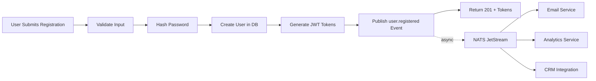
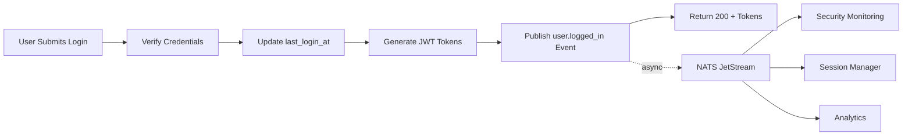
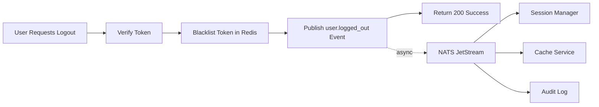
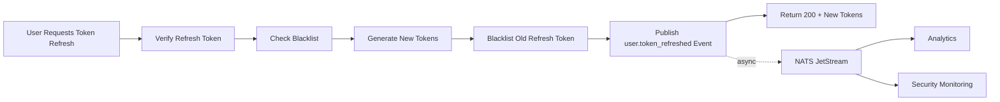

# Authentication Events Flow

## High-Level Architecture

```
┌─────────────────┐
│   Client App    │
└────────┬────────┘
         │ HTTP Request
         ▼
┌─────────────────────────────────────────────────────────┐
│                   Auth Service                          │
│  ┌──────────────────────────────────────────────────┐  │
│  │  POST /auth/register                             │  │
│  │  1. Validate input                               │  │
│  │  2. Hash password                                │  │
│  │  3. Create user in DB                            │  │
│  │  4. Generate JWT tokens                          │  │
│  │  5. ✨ Publish user.registered event             │  │
│  │  6. Return tokens + user                         │  │
│  └──────────────────────────────────────────────────┘  │
│                                                         │
│  ┌──────────────────────────────────────────────────┐  │
│  │  POST /auth/login                                │  │
│  │  1. Find user by email                           │  │
│  │  2. Verify password                              │  │
│  │  3. Update last_login_at                         │  │
│  │  4. Generate JWT tokens                          │  │
│  │  5. ✨ Publish user.logged_in event              │  │
│  │  6. Return tokens + user                         │  │
│  └──────────────────────────────────────────────────┘  │
│                                                         │
│  ┌──────────────────────────────────────────────────┐  │
│  │  POST /auth/refresh                              │  │
│  │  1. Verify refresh token                         │  │
│  │  2. Check blacklist (Redis)                      │  │
│  │  3. Generate new access token                    │  │
│  │  4. Generate new refresh token (rotation)        │  │
│  │  5. Blacklist old refresh token                  │  │
│  │  6. ✨ Publish user.token_refreshed event        │  │
│  │  7. Return new tokens                            │  │
│  └──────────────────────────────────────────────────┘  │
│                                                         │
│  ┌──────────────────────────────────────────────────┐  │
│  │  POST /auth/logout                               │  │
│  │  1. Extract token from header                    │  │
│  │  2. Verify token                                 │  │
│  │  3. Blacklist token (Redis)                      │  │
│  │  4. ✨ Publish user.logged_out event             │  │
│  │  5. Return success message                       │  │
│  └──────────────────────────────────────────────────┘  │
│                                                         │
│                         │                               │
│                         │ Fire-and-Forget               │
│                         │ (Non-blocking)                │
│                         ▼                               │
│  ┌──────────────────────────────────────────────────┐  │
│  │  Event Publishing Utility (events.ts)            │  │
│  │  - Build event with metadata                     │  │
│  │  - Encode as JSON                                │  │
│  │  - Publish to NATS                               │  │
│  │  - Log success/failure                           │  │
│  │  - Never throw errors                            │  │
│  └──────────────────────────────────────────────────┘  │
└────────────────────┬────────────────────────────────────┘
                     │
                     ▼
┌─────────────────────────────────────────────────────────┐
│               NATS JetStream                            │
│  ┌──────────────────────────────────────────────────┐  │
│  │  Stream: auth-events                             │  │
│  │  Subjects: auth.user.*                           │  │
│  │  Storage: File (persistent)                      │  │
│  │  Retention: 7 days, 100k msgs, 100MB             │  │
│  └──────────────────────────────────────────────────┘  │
└────────────────────┬────────────────────────────────────┘
                     │
                     │ Distribute to Subscribers
                     │
        ┌────────────┼────────────┬──────────────┐
        │            │            │              │
        ▼            ▼            ▼              ▼
┌──────────────┐ ┌──────────┐ ┌─────────────┐ ┌──────────┐
│Email Service │ │Analytics │ │Security     │ │Audit Log │
│              │ │Service   │ │Service      │ │Service   │
│Send welcome  │ │Track     │ │Monitor      │ │Record    │
│emails        │ │activity  │ │suspicious   │ │all auth  │
│              │ │          │ │logins       │ │events    │
└──────────────┘ └──────────┘ └─────────────┘ └──────────┘
```

## Event Publishing Pattern

### Fire-and-Forget Implementation

```typescript
// In auth route handler
try {
  // 1. Perform critical auth operation
  const user = await createUser(...);
  const tokens = await generateTokens(...);

  // 2. Log success
  fastify.log.info({ userId: user.id }, 'User registered successfully');

  // 3. Publish event (FIRE-AND-FORGET)
  //    This runs asynchronously and doesn't block the response
  publishUserRegistered(fastify.nats, user.id, user.email, user.name, fastify.log);
  //    ↑ No await - doesn't block
  //    ↑ Errors logged internally, never thrown

  // 4. Return response immediately
  reply.code(201);
  return { accessToken, refreshToken, user };

} catch (error) {
  // Auth operation failures are caught and handled
  // Event failures are handled inside publishUserRegistered()
}
```

### Event Publishing Flow

```
Route Handler
    │
    ├─ Perform Business Logic ✅
    │
    ├─ Log Operation Success ✅
    │
    ├─ Trigger Event Publishing ⚡ (async, non-blocking)
    │   │
    │   └─→ publishUserRegistered()
    │           │
    │           ├─ Build event payload
    │           │
    │           ├─ Add metadata (service, version, env)
    │           │
    │           ├─ Encode as JSON
    │           │
    │           ├─ Publish to NATS
    │           │   │
    │           │   ├─ Success → log.info() ✅
    │           │   └─ Failure → log.error() ⚠️ (but don't throw)
    │           │
    │           └─ Return (no value, errors handled)
    │
    └─ Return HTTP Response ✅ (not waiting for event)
```

## Event Schemas

### 1. user.registered



**Event Data**:
```json
{
  "userId": "uuid",
  "email": "user@example.com",
  "name": "John Doe",
  "timestamp": "2024-01-01T12:00:00.000Z"
}
```

### 2. user.logged_in



**Event Data**:
```json
{
  "userId": "uuid",
  "email": "user@example.com",
  "timestamp": "2024-01-01T12:30:00.000Z",
  "ip": "192.168.1.100",
  "userAgent": "Mozilla/5.0..."
}
```

### 3. user.logged_out



**Event Data**:
```json
{
  "userId": "uuid",
  "timestamp": "2024-01-01T13:00:00.000Z"
}
```

### 4. user.token_refreshed



**Event Data**:
```json
{
  "userId": "uuid",
  "timestamp": "2024-01-01T12:45:00.000Z"
}
```

## Error Handling Flow

```
Event Publishing Attempt
    │
    ├─ Try
    │   │
    │   ├─ Encode event as JSON
    │   │
    │   ├─ Publish to NATS
    │   │   │
    │   │   ├─ ✅ Success
    │   │   │   │
    │   │   │   └─→ Log: "Auth event published successfully"
    │   │   │       - Level: info
    │   │   │       - Data: { event, userId, timestamp }
    │   │   │
    │   │   └─ ❌ Failure (NATS connection error, timeout, etc.)
    │   │       │
    │   │       └─→ Log: "Failed to publish auth event"
    │   │           - Level: error
    │   │           - Data: { event, error, payload }
    │   │           - ⚠️ Does NOT throw error
    │   │           - ⚠️ Does NOT break auth flow
    │   │
    │   └─ Return (void)
    │
    └─ Catch (should never happen - all errors caught internally)
        │
        └─→ Log: "Failed to publish auth event"
```

## Subscriber Integration

### Durable Consumer Pattern (Recommended)

```
┌─────────────────────────────────────────┐
│     NATS JetStream                      │
│  Stream: auth-events                    │
│  ┌─────────────────────────────────┐   │
│  │ Messages (Persistent)           │   │
│  │ - user.registered               │   │
│  │ - user.logged_in                │   │
│  │ - user.logged_out               │   │
│  │ - user.token_refreshed          │   │
│  └─────────────────────────────────┘   │
└────────────┬────────────────────────────┘
             │
             │ Pull messages
             ▼
┌─────────────────────────────────────────┐
│  Consumer: email-service                │
│  - Durable name: email-service          │
│  - Ack policy: explicit                 │
│  - Max deliver: 3                       │
│  - Filter: auth.user.registered         │
│  ┌─────────────────────────────────┐   │
│  │ Process Message                 │   │
│  │ 1. Decode JSON                  │   │
│  │ 2. Send welcome email           │   │
│  │ 3. Acknowledge (ack)            │   │
│  └─────────────────────────────────┘   │
│                                         │
│  On Error:                              │
│  - Negative ack (nak)                   │
│  - Message redelivered (up to 3x)      │
│  - After 3 failures → dead letter queue │
└─────────────────────────────────────────┘
```

## Monitoring Dashboard Concept

```
┌────────────────────────────────────────────────────────┐
│  Auth Events Dashboard                                 │
├────────────────────────────────────────────────────────┤
│                                                         │
│  📊 Event Publishing Metrics (Last 24h)                │
│  ┌─────────────────┬──────────┬──────────┬──────────┐ │
│  │ Event Type      │ Count    │ Success  │ Failed   │ │
│  ├─────────────────┼──────────┼──────────┼──────────┤ │
│  │ user.registered │ 1,234    │ 1,234    │ 0        │ │
│  │ user.logged_in  │ 5,678    │ 5,675    │ 3 ⚠️     │ │
│  │ user.logged_out │ 890      │ 890      │ 0        │ │
│  │ user.refreshed  │ 3,456    │ 3,456    │ 0        │ │
│  └─────────────────┴──────────┴──────────┴──────────┘ │
│                                                         │
│  📈 Publishing Latency (p95)                           │
│  ┌─────────────────────────────────────────────────┐  │
│  │ ▁▂▃▄▅▆▇█▇▆▅▄▃▂▁  ~2ms avg                       │  │
│  └─────────────────────────────────────────────────┘  │
│                                                         │
│  🗄️  JetStream Stream Status                          │
│  ┌─────────────────────────────────────────────────┐  │
│  │ Messages: 45,678 / 100,000                       │  │
│  │ Size: 12 MB / 100 MB                             │  │
│  │ Oldest: 4 days ago                               │  │
│  │ Consumers: 4 active                              │  │
│  └─────────────────────────────────────────────────┘  │
│                                                         │
│  👥 Active Consumers                                   │
│  ┌─────────────────┬──────────┬──────────┬──────────┐ │
│  │ Consumer        │ Pending  │ Acked    │ Lag      │ │
│  ├─────────────────┼──────────┼──────────┼──────────┤ │
│  │ email-service   │ 0        │ 1,234    │ 0s       │ │
│  │ analytics       │ 12       │ 10,456   │ 2s       │ │
│  │ security        │ 0        │ 5,678    │ 0s       │ │
│  │ audit-log       │ 45       │ 11,258   │ 8s ⚠️    │ │
│  └─────────────────┴──────────┴──────────┴──────────┘ │
└────────────────────────────────────────────────────────┘
```

## Best Practices Summary

### For Publishers (Auth Service)

✅ **DO**:
- Use fire-and-forget pattern
- Log all publish attempts (success and failure)
- Include relevant context in events (IP, user agent)
- Use ISO 8601 timestamps
- Add service metadata
- Keep payloads small and focused

❌ **DON'T**:
- Block auth operations waiting for event publishing
- Throw errors when event publishing fails
- Include sensitive data (passwords, tokens)
- Publish duplicate events
- Skip logging

### For Subscribers (Consumer Services)

✅ **DO**:
- Use durable consumers
- Acknowledge messages after successful processing
- Implement idempotent handlers
- Set max delivery attempts
- Use dead letter queues
- Monitor consumer lag

❌ **DON'T**:
- Process same event multiple times (non-idempotent)
- Acknowledge before processing completes
- Block on slow operations
- Ignore consumer errors
- Create dependencies between events
